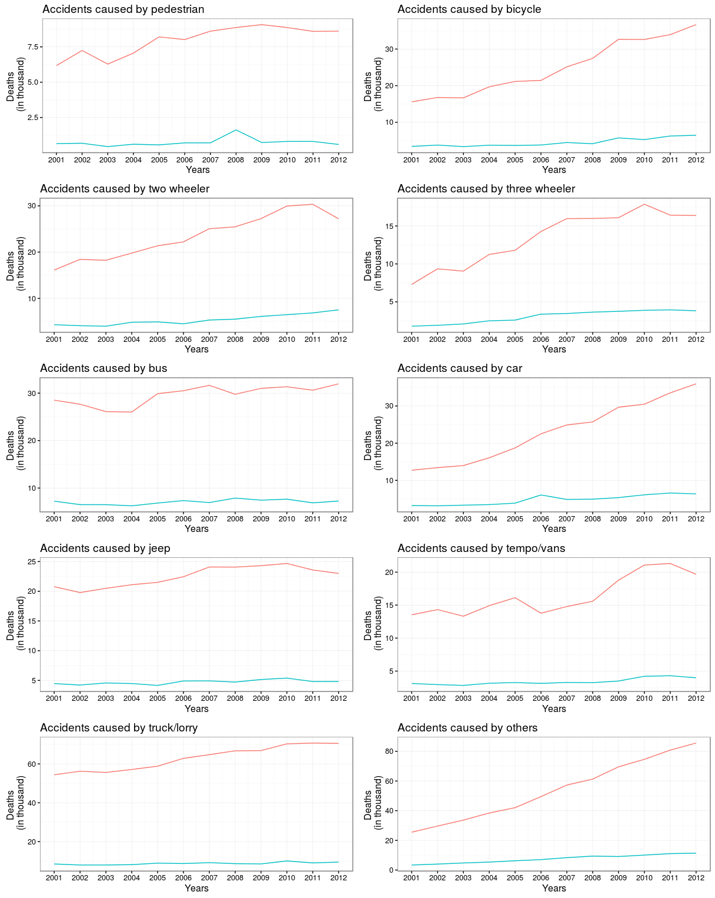
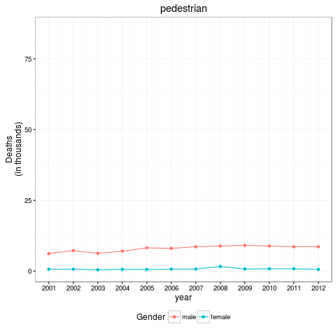

# road-accidents-in-india
Visualizations of road accidents in India from 2003 to 2011

> The estimates of the Planning Commission and the World Bank have put social cost of
> accidents between 2 to 3 per cent of the GDP every year. The nation is losing more than
> Rs. 1 lakh crore a year because of road accidents and this is besides the loss of human
> life and trauma.
>
> 
>  --- <cite>[National statistics of road traffic accidents in India](http://www.jotr.in/article.asp?issn=0975-7341;year=2013;volume=6;issue=1;spage=1;epage=6;aulast=Ruikar)</cite>

## Visualizations  

### Deaths in road accidents from year 2001-2012

### Animation  

  

